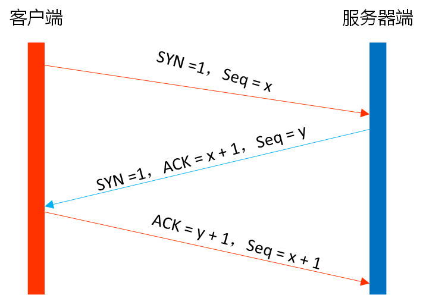
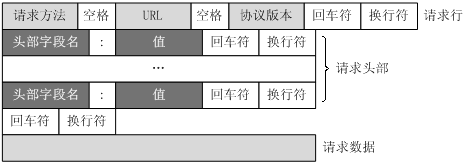
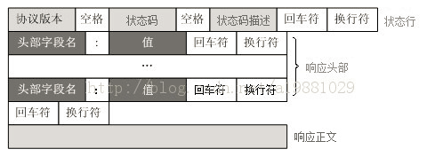
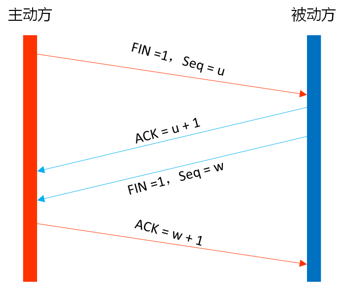

关于 “从输入URL到页面加载发生了什么”这个问题，自己觉得有必要梳理一下，毕竟从深度和广度来说，它都是一个有话可谈的话题。我仅从前端和网络基础的角度来对该题做个总结！

总体来说该过程分为以下几步:

1. DNS解析
2. TCP连接
3. 发送HTTP请求
4. 服务器处理请求并返回HTTP报文
5. 浏览器解析渲染页面
6. 连接结束

#### 1.DNS解析

**DNS指将字符串域名映射为对应的IP地址。**请求方发起请求的前提是知道自己的请求该发向哪，而在地址栏里输入的网址其实就是对方的地址，比如www.baidu.com、www.taobao.com等，这种写法很方便用户记忆，而无需输入一长串无记忆点的IP地址，但在网络中机器之间只能互相识别IP地址，所以要将域名映射为IP地址。

DNS是应用层协议，域名解析运行在UDP协议之上。**为什么选择UDP而非TCP？**原因如下：UDP无需连接，时效性更好，进行一次查询只需要两个DNS包。而TCP需要先用3个包建立连接，再用2个DNS包进行查询，最后用4个包断开连接，连接成本远大于查询本身，容易让DNS服务器不堪重负。

##### **DNS查询**

- 先检查本地hosts文件是否有这个网址映射关系，如果有就调用这个IP地址映射，完成域名解析。
- 否则，查找本地DNS解析器缓存，如果查找到则返回。
- 否则，查找本地DNS服务器，如果查找到则返回。
- 否则，按根域名服务器 -->顶级域名服务器-->次级域名服务器 -->主机名的IP地址的顺序依次查找下去，直到查找到IP地址。以输入www.baidu.com为例，默认所有网址尾部是有个.的，这里即www.baidu.com.，这个.对应的就是根域名服务器，所以网址真正的解析过程为:` .` -> `.com `-> `google.com. `->` www.baidu.com.`。

#### 2.TCP连接

HTTP协议是使用TCP作为其传输层协议的,在HTTP请求发送前还要通过**三次握手**建立连接。

1. 第一次握手：建立连接。客户端发送连接请求报文段，将`SYN`位置为1，`Sequence Number`为x；然后，客户端进入`SYN_SEND`状态，等待服务器的确认；
2. 第二次握手：服务器收到`SYN`报文段。服务器收到客户端的`SYN`报文段，需要对这个`SYN`报文段进行确认，设置`Acknowledgment Number`为x+1(`Sequence Number`+1)；同时，自己自己还要发送`SYN`请求信息，将`SYN`位置为1，`Sequence Number`为y；服务器端将上述所有信息放到一个报文段（即`SYN+ACK`报文段）中，一并发送给客户端，此时服务器进入`SYN_RECV`状态；
3. 第三次握手：客户端收到服务器的`SYN+ACK`报文段。然后将`Acknowledgment Number`设置为y+1，向服务器发送`ACK`报文段，这个报文段发送完毕以后，客户端和服务器端都进入`ESTABLISHED`状态，完成TCP三次握手。

##### **问：为什么需要进行三次握手，而不是两次握手？**

原因是两次握手不可靠，防止已经失效的连接请求报文段突然又传送到了服务器端而产生错误。设想只有两次握手的场景，假如客户端某次发出的请求由于网络滞留原因最终到达了服务器端，但此时该请求已失效，而服务器端却会认为这是客户端发起的一次新请求，就会向客户端发出应答报文。而客户端认为自己没有发出请求，就不会对此做出响应，此时另一端的服务器通过两次握手以为建立了连接，一直等待客户端发来数据，白白浪费了资源。而三次握手的情况下，服务器端只有明确收到了客户端的应答报文，才可以确定客户端是想要建立连接的。

#### 3.发送HTTP请求

其实这部分又可以称为前端工程师眼中的HTTP，它主要发生在客户端。发送HTTP请求的过程就是构建HTTP请求报文并通过TCP协议发送到服务器指定端口**(HTTP协议默认端口80, HTTPS协议默认端口443)**。

更相关的内容在[你想知道的AJAX都在这里](http://www.wuxuann-n.cn/2017/08/20/%E4%BD%A0%E6%83%B3%E7%9F%A5%E9%81%93%E7%9A%84AJAX%E9%83%BD%E5%9C%A8%E8%BF%99%E9%87%8C/)一文中已有介绍，可参考。这里就放出HTTP请求报文的直观图，并补充上文没讲的一点内容。

##### **补充：http请求方法**

HTTP/1.1 定义的请求方法有8种：GET、POST、PUT、DELETE、PATCH、HEAD、OPTIONS、TRACE。

- OPTIONS：返回服务器针对特定资源所支持的HTTP请求方法。也可以利用向Web服务器发送'*'的请求来测试服务器的功能性。 
- HEAD：向服务器索要与GET请求相一致的响应，只不过响应体将不会被返回。这一方法可以在不必传输整个响应内容的情况下，就可以获取包含在响应消息头中的元信息。 
- GET：向特定的资源发出请求。 
- POST：向指定资源提交数据进行处理请求（例如提交表单或者上传文件）。数据被包含在请求体中。POST请求可能会导致新的资源的创建和/或已有资源的修改。 
- PUT：向指定资源位置上传其最新内容。 
- DELETE：请求服务器删除Request-URI所标识的资源。 
- TRACE：回显服务器收到的请求，主要用于测试或诊断。 
- CONNECT：HTTP/1.1协议中预留给能够将连接改为管道方式的代理服务器。

**补充：HTTPS**

现在https用的也是越来越多，所以这边穿插一点https的知识！

HTTP报文是包裹在TCP报文中发送的，服务器端收到TCP报文时会解包提取出HTTP报文，网络请求需要很多路由器的转发，HTTP报文是明文的，所以容易在中间节点处被篡改信息。那么在HTTP报文进入TCP报文之前，先使用SSL/TLS对HTTP报文进行加密就可以解决这个问题了。从网络的层级结构看SSL/TLS位于HTTP协议与TCP协议之间。

##### 为什么HTTPS安全

HTTPS更安全，是因为它利用 了SSL/TLS协议传输，SSL/TLS协议的基本思路是采用[公钥加密法](http://en.wikipedia.org/wiki/Public-key_cryptography)，也就是说，客户端先向服务器端索要公钥，然后用公钥加密信息，服务器收到密文后，用自己的私钥解密。虽然HTTPS相比于HTTP更安全，但是势必会带来一些时间上的损耗，如握手和加密等过程，是否使用HTTPS需要根据具体情况在安全和性能方面做出权衡。具体过程请参考经典的阮一峰先生的博客[SSL/TLS协议运行机制的概述](http://www.ruanyifeng.com/blog/2014/09/illustration-ssl.html)。

#### 4.服务器处理请求并返回HTTP报文

这里只放出HTTP响应报文的图：

服务器返回给浏览器的文本信息，通常HTML, CSS, JS, 图片等文件就放在响应正文这一部分。

#### 5.浏览器解析渲染页面

接下来的工作就是浏览器接收HTML,CSS,JS文件后，如何将页面呈现在我们眼前？这就是浏览器解析渲染页面的过程了！

**总体流程简单来说：** 

- 根据HTML结构生成DOM Tree
- 根据CSS生成CSSOM
- 将DOM和CSSOM整合形成Render Tree
- 根据Render Tree开始渲染和展示
- 遇到<script>时，会执行并阻塞渲染

这张图也挺经典的，就直接拿来用来讲解了。

##### **整个过程解释**：

浏览器接收到html文档，会被浏览器的HTML PARSER(HTML 解析器)解析， 通过词法分析将tag分析为相应的token，对HTML文档从上往下依次去解析token，这个过程的特点一是从上往下的，二是在此法分析的过程可以解析出link、script这样的标签，这些标签里面对应的外部资源会进一步由浏览器向网络发起请求（请求CSS和js等资源 ）。css相关的资源请求回来后会由浏览器生成相应的CSS树。将dom树和css树进行合并生成render tree渲染树，之后再进行布局layout和绘制paint，最后成功渲染出页面。

##### **问1：为什么要把css放在head中？**

将css样式放在head中引入，会先加载css，之后浏览器就知道这个css规则了，然后他在渲染DOM节点的时候就按照已知的css规则来渲染。

反例：如果把css内容放在DOM节点之后引入，会首先按照默认样式渲染dom内容（比如字体16px），之后加载完css发现样式的宽啊高啊都得改变，又得重新去渲染一遍，这时可能会出现屏幕的跳变，这个变化可能快可能慢，和你的电脑配、网络情况、页面规模等有关，用户体验差，所以得出结论，css要放在head中，而不要放在body中。 

##### **问2：为什么要把js放在body最下面？**

script引入的js会阻塞页面渲染，因为script的js代码有权改变dom结构和dom内容。

遇到script会先加载和执行相应的js，该过程完毕后才会继续加载解析后续的页面。把js放在body最下面，一方面这样就不会阻塞页面的渲染了，能让页面更快地出来；放在下面，加载到它时，它已经能拿到所有标签，而放到中间，就有可能拿不到它后面的标签了，对后面标签所做的操作就失效了。

#### 6.结束连接

**1.第一次挥手：** 主动方（可以使客户端，也可以是服务器端），设置Sequence Number，向被动方发送一个FIN报文段，告诉另一方我打算断开连接，后面不会再发送数据了，但是此时主动关闭方还是可以接收数据的。

**2.第二次挥手：**被动方收到了主动方发送的FIN报文段，向主动方回一个ACK报文段（Acknowledgment Number为Sequence Number + 1），告诉主动方，我“同意”你的关闭请求；

**3.第三次挥手：**被动方收到断开连接信息时，可能还有数据没有传完，所以等待数据全部传输结束后，再发送一条 FIN 为 1 的信息，告诉对方也做了断开连接的准备，但没有断开。

**4.第四次挥手：** 主动方收到被动方发送的FIN报文段，向被动方发送ACK报文段，被动方收到主动方的ACK报文段以后，就关闭连接；此时，主动方等待2MSL后依然没有收到回复，则证明Server端已正常关闭，那好，主动方也可以关闭连接了。

##### 问：为什么需要进行四次挥手？

第一次挥手是在主动方没有数据需要再发送过去的情况下发起的，第二挥手是被动方发送ACK表示同意，当然，如果在第二次挥手时被动方也向主动方发送FIN包请求断开连接似乎也行，但考虑到它自己有可能还有数据没有发送完，所以当它真的没有数据可发了，才会进行第三次挥手发送FIN包告诉主动方，我也不再发送数据了，之后主动发再送ACK以表确认，即第四次挥手。

简而言之，一端断开连接需要两次挥手（请求和回应），两端断开连接就需要四次挥手了。

#### 参考链接

[从输入URL到页面加载发生了什么](https://segmentfault.com/a/1190000006879700)

[从输入URL到页面加载完的过程中都发生了什么事情？](http://www.berlinix.com/net/from-url-input.php)

[从输入 URL 到页面加载完的过程中都发生了什么事情？](http://www.guokr.com/question/554991/)
