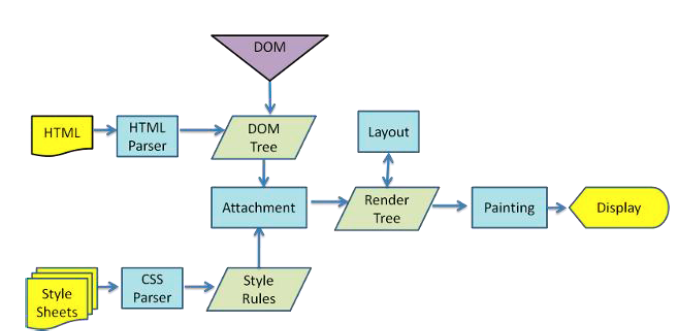

这一过程要细说起来，涉及的东西应该说是非常广泛的，但是就前端开发而言，个人认为主要分为以下几个部分，这样理解起来不至于晦涩难懂，而且列出来的东西也差不多够了

在讲述主要过程的同时，我会对涉及到的某些要点做些补充说明，希望能帮助大家多理解一些东西。

总体来说分为以下几个过程:

1. DNS解析
2. TCP连接
3. 发送HTTP请求
4. 服务器处理请求并返回HTTP报文
5. 浏览器解析渲染页面
6. 连接结束

1.DNS解析

DNS其实是域名和IP地之间的 映射关系。

2.TCP连接

当TCP出现瓶颈时，HTTP也会受到影响

------

为什么需要进行三次握手，而不是两次握手？

原因是两次握手不可靠。比如，浏览器发送一个连接请求包A，但包A在半路上堵车了，浏览器就认为包A丢失了，所以重新发生一个请求包B给服务器。服务器收到请求，建立连接。两端进行通信，结束后关闭连接。但是这时候，包A到达了服务器，服务器不知道这是一个无效的包，所以进行响应。这时两次握手已经完成，两端就建立起一个无效的连接。但浏览器认为自己没发出请求，所以不会回应，这样就让服务器白白等待回应，浪费了服务器资源。而三次握手的机制下，浏览器知道自己并没有请求连接，会发送拒绝包给服务器，服务器收到回应后也会结束这次无效的连接。

### 浏览器解析渲染页面

**总体流程简单来说： 解析html以构建dom树->构建render树->布局render树->绘制render树**

这张图也挺经典的，就直接拿来用来讲解了。

### 参考链接

[从输入URL到页面加载发生了什么](https://segmentfault.com/a/1190000006879700)

[从输入URL到页面加载完的过程中都发生了什么事情？](http://www.berlinix.com/net/from-url-input.php)

[从输入 URL 到页面加载完的过程中都发生了什么事情？](http://www.guokr.com/question/554991/)

